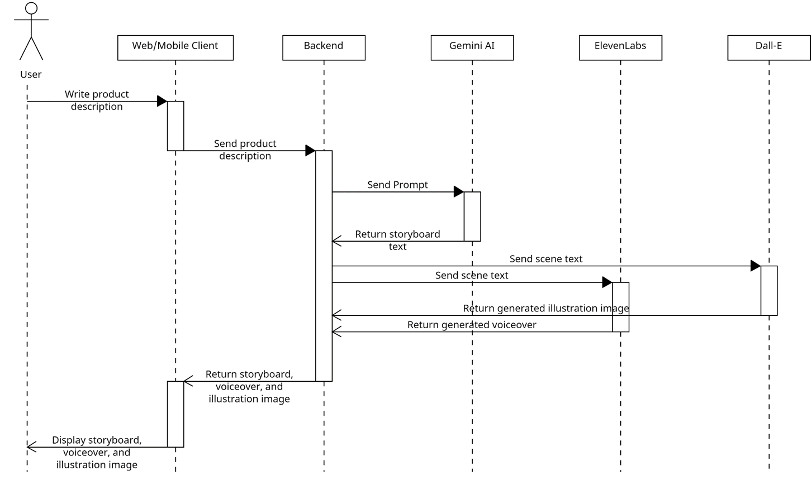

# Charismatic (Team BuzzLightyear)

Charismatic is an Android and Web application designed to assist MSMEsin creating and perfecting promotional materials for their products.
Charismatic enables users to create visually stunning promotional content and evoke emotions with powerful storytelling.
The use of advanced AI technology in Charismatic makes it easier for users to craft narratives that are not only appealing but also effectively conveyed.
As a result, each promotion becomes more persuasive, informative, and captivating to a wide range of consumers.
The technology includes features such as narrative video generator, storyboard maker, natural-toned narrator voice overs, text presentation generator with natural-toned voice overs, and product photo editor.

## Teams

Hustler - **Silvia Larasatul Masyitoh**

Hipster - **Enrico Olivian Maricar**

Hacker - **Widya Ardianto**

## Progress

In this stage 2 of submission in Hackfest 2024, I made the main logic from the previous submitted sequence diagram.



This repository is an API Service written in Go. It uses Gemini AI to generate video storyboard, elevenLabs to generate voice over, and Dall-E to generate storyboard illustration.

## How to use

Run the app

```go run main```

By default, it will run in ```127.0.0.1:8000```.
### Curl

Request
```
curl --location 'http://localhost:8000/v1/video/generate' \
--header 'Content-Type: application/json' \
--data '{
    "product_title": "AquaVita",
    "brand_name": "PureFlow",
    "product_type": "Air Mineral Murni",
    "market_target": "Semua Usia dan Gaya Hidup Sehat",
    "superiority": "Sumber Air Alamiah: AquaVita berasal dari mata air alamiah yang kaya mineral, memberikan keaslian dan kesegaran yang unik. \nProses Pemurnian Tinggi: Menggunakan teknologi canggih untuk menjaga kebersihan dan kemurnian air, memastikan kualitas terbaik untuk konsumen.\n Kemasan Ramah Lingkungan: Botol yang dapat didaur ulang dan ramah lingkungan, mendukung komitmen kami terhadap keberlanjutan. \nKandungan Mineral Optimal: Mengandung sejumlah mineral esensial untuk keseimbangan tubuh, memenuhi kebutuhan harian nutrisi Anda.\nRasa Alami: Tidak ada tambahan bahan kimia atau perasa buatan, AquaVita memberikan sensasi rasa alami air mineral segar.\nDesain Modern: Kemasan yang elegan dan praktis, cocok untuk gaya hidup aktif dan sibuk.\n Dukungan Kesehatan: Dengan konsumsi rutin, AquaVita membantu menjaga hidrasi optimal, mendukung fungsi organ, dan meningkatkan kesehatan secara keseluruhan.",
    "duration": 60
}'
```

### Postman

Import this collection

https://api.postman.com/collections/9208271-d4d7f745-d119-4bab-a565-4017d1dffbf4?access_key=PMAT-01HKZ9NRZMZE9Y2JAR95MAPD84